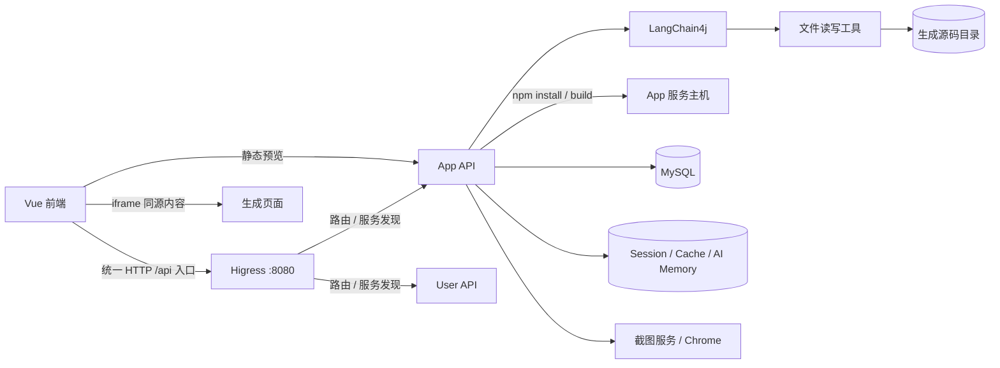

# 全栈架构优化与最终整改基线

> 评审日期：2026-09-23
> 范围：本仓库 Java 21 / Maven 后端及 `/Users/inl/JetBrains/WebStorm/lin-ai-code-mother-frontend` Vue 3 前端
> 依据：三份历史评审/整改文档、现有整改清单，以及本次对生成、预览、认证、数据查询、SSE 和前端渲染链路的源码复核。
> 状态说明：本文件是当前建议执行基线；历史文件保留为评审记录。源码中尚未落地的整改不因历史文档已描述而视为完成。

## 结论

**当前版本不具备公网发布条件（NO-GO）。** 最大风险是同一信任域串起 AI 文件工具、宿主机 npm 构建、静态文件读取和浏览器预览：AI 能写项目文件，后端随后执行项目脚本，静态接口又能从生成源码根目录返回文件，预览 iframe 没有浏览器隔离。凭据和认证边界也未达到生产要求。

当前最短可行路径是先关闭高危入口并轮换凭据，再修复路径/预览/XSS/排序根因，恢复干净环境的构建与测试门禁。异步生成、对象存储、网关重构和缓存体系不应挡住止血，也不应在没有容量证据时先行建设。

## 当前证据

| 检查 | 结果 | 直接证据 |
|---|---|---|
| 前端 `npm run type-check` | 失败 | `vite.config.ts` 语法错误；`UserManagePage.vue` 把字符串 ID 传给数值 ID 参数 |
| 前端 `npm run build` | 失败 | Vite 无法解析 `vite.config.ts` |
| 前端 `npx eslint . --no-fix` | 失败，15 个错误 | 生成 API 的 `@ts-ignore`、显式 `any`、未使用参数及配置解析错误 |
| 后端 `mvn -pl lin-ai-code-app -am test` | 失败，9 项中 4 项失败 | `AppCreationQuotaServiceTest` 预期 `insert`，当前实现使用 `insertSelective` |
| AI 文件工具与构建隔离 | 未整改 | 文件工具允许绝对路径；`VueProjectBuilder` 在服务进程中执行 `npm install` 和 `npm run build` |
| 静态预览与 XSS | 未整改 | `/static` 直接读取生成目录；Markdown 使用 `html: true` 与 `v-html`；预览 iframe 无 `sandbox` |

门禁复核命令已在当前工作区执行。前端使用 Node 24.18.0/npm 11.16.0，而仓库约定 Node 22，因此门禁恢复后仍需在固定 Node 22 和干净 clone 中复验。测试失败不等于其他模块已充分测试；安全结论仍需部署环境动态验证。

## 架构判断

当前核心调用路径如下：

设计上的主要问题不是微服务数量不足，而是**信任边界和职责边界不成立**：不可信生成物与 API 进程共享文件系统/执行权限；生成内容与主站共享浏览器安全上下文；公开 DTO、内部 RPC 和 Session 对象承载了过多身份与业务信息；SSE 把生成、持久化、构建和发布状态压在单个请求生命周期里。

目标状态应先做到：API 进程不执行不可信代码；生成文件按明确根目录操作；预览仅发布已验证产物并经过权限检查；不可信页面使用独立站点和最小 iframe 权限；会话只携带最小身份；失败只发送失败语义。只有这些边界稳定后，才评估拆 Worker、对象存储或网关。

## 整改顺序

### P0：发布前必须完成

| ID | 问题与证据 | 最小整改 | 验收 |
|---|---|---|---|
| `P0-01` | 生成 Vue 文件会进入服务主机的 `npm install`/`npm run build`。`FileWriteTool` 可覆盖 `package.json`，`AiCodeGeneratorFacade` 在模型完成后直接构建。 | 立即关闭公网 Vue 生成/构建/部署；永久方案使用一次性非特权沙箱，固定模板、lockfile 和脚本，限制网络/资源/目录，任务后销毁。`--ignore-scripts` 不能代替沙箱。 | 恶意 lifecycle/build 脚本不能触及宿主机、密钥、内网和项目根外；超时可终止完整进程组并清理。 |
| `P0-02` | 五个 AI 文件工具以 `Paths.get`/`resolve` 直接访问路径，未规范化并限制在项目根内，也未防 symlink。 | 在 AI 工具和下载遍历共享的文件边界处加入根目录解析与校验；拒绝绝对路径、越界路径和符号链接逃逸，并设单文件/总量上限。代码输出目录由专用服务账号拥有，所有项目子目录使用 `0700`，不得让不可信进程以相同账号写入。 | 覆盖绝对路径、`..`、编码、盘符、symlink；越界操作均拒绝，合法项目路径可用；确认运行账号和完整目录树权限。 |
| `P0-03` | `StaticResourceController` 从 `CODE_OUTPUT_ROOT_DIR` 对外提供文件，无 owner 检查且包含源码目录；穿越利用需要动态确认。 | 暂停公网静态入口；之后只暴露经过验证的 `dist`/固定 HTML 产物，使用 owner 或短时签名授权、canonical 根校验、symlink 拒绝、`nosniff`。源码根不得充当发布目录。 | 匿名和跨用户不能读取源码/配置；越界矩阵无根目录外访问；授权预览可访问必要产物。 |
| `P0-04` | `MarkdownRenderer` 对 AI/历史内容启用原始 HTML 并通过 `v-html` 注入。 | Markdown-it 设 `html: false`；若确需 HTML，再以明确的成熟 sanitizer 白名单恢复有限标签。 | 实时、历史及工具结果中的事件属性、SVG、危险 URL 均不执行。 |
| `P0-05` | 预览 iframe 无 `sandbox`；可视化编辑器读取 iframe DOM、接受未校验消息并向 `*` 发消息。 | 生成页迁移到独立站点，不共享 API Cookie；iframe 使用最小 `sandbox="allow-scripts"` 且不加 `allow-same-origin`。编辑桥接需校验 `source`、`origin`、随机 nonce 和消息结构，使用精确 `targetOrigin`。 | 生成脚本无法读取父 DOM/API 响应或顶层导航；伪造消息无效，合法编辑能力仍通过。 |
| `P0-06` | App/User 查询将客户端 `sortField` 传入原始 `orderBy`；CORS 同时允许任意 Origin 与凭据。 | 排序字段改固定列白名单，方向只接受 `ascend/descend`；CORS 改配置化精确 Origin。Cookie 写操作补 CSRF；生成接口改 POST body + fetch 流/短时流凭据。 | 注入式排序输入 400；非白名单 Origin 无跨域授权；无 CSRF 的跨站写失败；prompt 不出现在 URL/访问日志。 |
| `P0-07` | 配置存在已跟踪默认凭据及本地 profile 风险；推理模型配置强制记录请求/响应正文。 | 撤销并轮换曾出现在代码/本地配置/日志中的凭据；生产 Secret 外置，缺失即启动失败；生产默认不激活 local；关闭正文日志并审查旧日志、镜像、备份。 | 旧凭据失效；构建物、日志和生产配置扫描无 Secret、prompt、源码及 Authorization 正文。报告和工单不记录 Secret 值。 |

未完成 P0 时，部署层应保持 Vue 构建/静态公网预览关闭；不能把“后续迭代”作为运行中的补偿控制。

### P1：下一迭代内闭环

| 主题 | 整改重点 | 完成标准 |
|---|---|---|
| 身份和会话 | 固定盐 MD5 迁移到 BCrypt/Argon2id 随机盐；旧凭据成功登录时渐进升级。Session 仅存 userId/最小元数据，登录轮换 Session ID，注销失效 Session。账号、角色、禁用状态在请求边界刷新；账号/IP 登录限速。管理员不再发统一默认密码，不向 API/Dubbo 返回 User 实体。 | 相同密码产生不同哈希；旧用户可迁移；权限变更下一请求生效；响应不含 password hash；失败登录受限。 |
| API 契约 | 普通 HTTP 错误使用真实状态码；SSE 只有产物保存/构建和校验完成后发送 `done`，错误发稳定错误码与 traceId。Snowflake ID 在 API/OpenAPI/TS 全链路用字符串。公开 DTO 与 owner/admin DTO 分离。 | 失败构建无 `done`；前端无固定 sleep 假设；超过 `2^53-1` 的 ID 不变形；私有 app 不通过公开详情泄露 prompt/deployKey。 |
| 数据完整性 | 对 `user_account`、`deploy_key` 加数据库唯一约束和可重复迁移；删除 App 的关联数据清理具备事务/可靠失败策略；部署先写临时版本、验产物、再原子切换。聊天游标使用 `(createTime,id)`。 | 并发注册只产生一个账户；同时间戳分页无重漏；失败删除/部署可回滚或明确重试，不留半成品。 |
| 并发与成本 | 认证/所有权检查后按 user+app 限流；提示词大小、文件数、生成时长和日成本服务端设硬上限；当前共享可变 AI memory 按 app 串行或按请求隔离，传播客户端取消。无命中率证据的缓存先删除。 | 未授权请求不消耗额度；相同 app 不发生并发上下文串写；队列/线程/成本均有硬上限；断连能取消生成。 |
| 前端交付 | 修复 Vite 配置、类型与 ESLint；把 API 客户端、视觉编辑器和 lockfile 纳入版本控制或提供可重复生成步骤；使用 Node 22；浏览器统一请求 Higress `:8080`，按 API path 由网关路由到 Nacos 注册的 user/app 服务。修正管理筛选契约、路由参数切换、EventSource/listener 清理、稳定消息引用和安全错误提示。 | 干净 clone 执行 `npm ci`、type-check、eslint、build 均通过；验证浏览器请求统一到 `:8080`，网关按 path 路由到正确服务且 Cookie/SSE 正常，切换 app 不串流/串消息。 |
| 服务交付 | 为运行服务执行 Spring Boot repackage；Dubbo/Nacos 仅内网可达并加服务鉴权；截图 URL 需 scheme/host/redirect allowlist，Chrome 恢复 sandbox，不运行时下载 driver。 | Jar 有 `BOOT-INF`/`Main-Class` 且可启动；外部不能直达内部 RPC；截图不能访问 `file:`、metadata、私网和非授权目标。 |

### P2：由指标触发

| 触发条件 | 最小演进 | 不提前建设的原因 |
|---|---|---|
| 生成占满请求超时或并发超出单机 worker 容量 | taskId + 有界 Worker + 明确任务状态与取消 | 当前首要问题是隔离和失败语义；消息队列本身不解决不可信执行。 |
| 多实例/重启导致本地产物不可用 | 版本化对象存储 + 独立静态域/CDN | 当前先统一产物根、授权和发布流程。 |
| 截图 P95 或资源队列越过预算 | 有界 browser worker/context + 出站网络策略 | 先补 URL 安全、sandbox 和任务隔离。 |
| 无法定位慢请求/成本偏差 | traceId、AI token、DB/构建/截图耗时与磁盘指标 | 先定义 SLO 和采集最小指标，不先搭全套平台。 |
| 首屏、聊天渲染或历史内存超过预算 | 路由懒加载、按需组件/高亮语言、历史窗口化 | 先建立 bundle、交互延迟和内存基线。 |
| CVE/依赖体积成为交付阻断 | SBOM、依赖收敛与升级门禁 | 依赖优化须由真实风险或维护成本驱动。 |

## 发布验收门禁

1. P0 已在代码和部署配置中落实；动态 PoC 通过，或公网入口保持关闭并记录负责人、恢复条件和期限。
2. 后端 JDK 21 下 `mvn clean verify` 通过，且 `lin-ai-code-app`、`lin-ai-code-screenshot` 定向测试通过。
3. 前端固定 Node 22 下 `npm ci`、`npm run type-check`、`npx eslint . --no-fix`、`npm run build` 通过。
4. 干净 clone 不依赖本机 `target/`、`tmp/`、未跟踪文件、IDE 配置或本地 profile；服务 Jar 检查及 `java -jar` 启动通过。
5. 归档 P0/P1 的代码与配置 diff、命令退出码、动态验证、迁移/回滚说明；Secret、Cookie、代理可信边界、静态域和内部 RPC 网络策略均有部署证据。

## 源码定位速查

| 主题 | 文件 |
|---|---|
| 生成期文件访问 | `lin-ai-code-ai/src/main/java/com/lin/linaicodemother/ai/tools/FileReadTool.java`、`FileWriteTool.java`、`FileModifyTool.java`、`FileDeleteTool.java`、`FileDirReadTool.java` |
| AI 完成后保存/构建 | `lin-ai-code-app/src/main/java/com/lin/linaicodeapp/core/AiCodeGeneratorFacade.java`、`core/builder/VueProjectBuilder.java` |
| 静态预览与排序 | `lin-ai-code-app/src/main/java/com/lin/linaicodeapp/controller/StaticResourceController.java`、`service/impl/AppServiceImpl.java` |
| 用户排序、密码及 Session | `lin-ai-code-user/src/main/java/com/lin/linaicodemother/service/impl/UserServiceImpl.java`、`controller/UserController.java` |
| CORS、会话与默认凭据 | `lin-ai-code-common/src/main/java/com/lin/linaicodemother/config/CorsConfig.java`、`lin-ai-code-app/src/main/resources/application.yml`、`lin-ai-code-user/src/main/resources/application.yml` |
| 模型正文日志与 Redis 类型边界 | `lin-ai-code-ai/src/main/java/com/lin/linaicodemother/ai/config/ReasoningStreamingChatModelConfig.java`、`lin-ai-code-app/src/main/java/com/lin/linaicodeapp/config/RedisCacheManagerConfig.java` |
| 浏览器渲染、预览与 SSE | 前端 `src/components/MarkdownRenderer.vue`、`src/pages/app/AppChatPage.vue`、`src/utils/visualEditor.ts`、`src/request.ts` |
| 前端构建、统一入口与 OpenAPI 生成 | 前端 `vite.config.ts`、`src/config/env.ts`、`openapi2ts.config.ts`、`package.json` |

## 网关补充：Higress 与 Nacos

前端运行时以 Higress `:8080` 作为唯一 API 入口是本项目的目标部署方式。Nacos 负责服务注册/发现，Higress 按稳定 API path 将请求转给 user/app 等后端服务；浏览器不应直接访问 8124/8125。运行时 `VITE_API_BASE_URL`、Vite 开发 proxy 和生产反向代理应保持同一个入口语义（例如 `/api` 经本地 proxy 转发到 `http://localhost:8080`）。

因此，旧整改稿里“若没有统一网关，分别配置 user/app API base URL”的条件不适用于当前部署前提；整改重点改为验证 Higress route/path、Cookie 域与 SameSite/Secure、CORS/CSRF、SSE streaming/timeout/header buffering，以及登录/静态资源等路径均正确转发。OpenAPI 生成所需的 schema URL（当前配置指向 8124）属于开发期代码生成输入，需单独确认网关是否提供聚合 schema 或继续直连内部服务；它不改变浏览器运行时统一走 8080 的结论。

本地工作树的 `vite.config.ts` 仍有 `target` 行后的 `addApp` 语法残留，本次复核确认它会导致 Vite 构建失败。修复时保留 `localhost:8080` proxy target，并删除该残留；这与统一网关方案一致。

## 评审范围与限制

本次复核覆盖 Maven 模块结构与配置，并重点逐链阅读 AI 工具到文件写入/构建、静态资源和 iframe 预览、App/User 排序与认证、会话/CORS、生成 SSE 与前端流处理、Markdown 渲染和前端构建链。结论依据源码与本次本地门禁；生产域名、反向代理规则、Redis ACL、Nacos 暴露面、容器权限和实际 Cookie 属性需要在部署环境动态验证。

两个仓库都有未提交内容。本次只新增本报告，没有改动业务代码，也没有覆盖现有未跟踪/未提交文件。前端工作树中的 `vite.config.ts`、OpenAPI 配置、`src/api/`、`src/utils/visualEditor.ts` 和 `package-lock.json` 必须进入干净 clone 验证；本机能读到不等于可交付。

## 历史评审合并方式

- `FULL_CODE_REVIEW_2026-09-21.md` 保留原始发现和影响链。
- `FULL_CODE_REVIEW_REMEDIATION_2026-09-22.md` 保留历史整改分级。
- `FINAL_OPTIMIZATION_REMEDIATION_2026-09-22.md` 与 `FINAL_REMEDIATION_CHECKLIST_2026-09-22.md` 提供上一版台账和验收项目。
- 本文件按 2026-09-23 源码与本次命令结果更新执行顺序；未运行的动态 PoC、未验证的部署假设仍保持待证状态。
