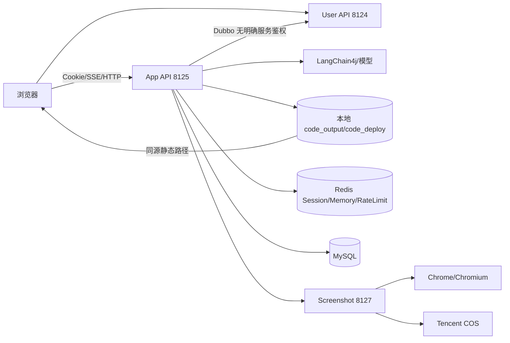

# 老林 AI 应用生成平台最终优化与整改基线

> 文档版本：`2026-09-22-final`
>
> 适用范围：后端 `lin-ai-code-mother-microservices` 与前端
> `/Users/inl/JetBrains/WebStorm/lin-ai-code-mother-frontend`
>
> 文档定位：本文件是两份历史评审之后的唯一执行基线。历史文件保留为证据，不再作为当前状态的第二份台账。

合并依据：[`FULL_CODE_REVIEW_2026-09-21.md`](./FULL_CODE_REVIEW_2026-09-21.md) 与 [`FULL_CODE_REVIEW_REMEDIATION_2026-09-22.md`](./FULL_CODE_REVIEW_REMEDIATION_2026-09-22.md)，并以本次后端、前端和构建验证结果校正证据等级。

## 1. 发布结论

**当前版本 NO-GO，不得直接公网发布。** 这不是“代码风格还可以优化”，而是存在一条可闭合的高风险链：普通登录用户提交提示词，AI 工具写入项目文件，应用服务在宿主机执行生成项目的包管理脚本，随后同一服务还可能把源码或生成页面暴露给浏览器上下文。

发布前必须同时满足以下硬门槛：

1. 关闭或隔离不可信 Vue 构建；宿主机进程不能执行 AI 生成的脚本。
2. 所有 AI 文件操作和静态资源访问都限制在明确根目录/构建产物，且经过所有权校验。
3. 关闭原始 AI HTML、通配凭据 CORS、长期旧角色会话和固定弱密码链路。
4. 排序白名单、真实 HTTP 错误语义、数据库唯一约束和前后端构建门禁全部通过。
5. 在干净 clone、固定 JDK 21/Node 22 环境连续两次完成工程门禁。

在上述门槛完成前，允许的临时策略只有：关闭 VUE_PROJECT 生成/部署、关闭公网静态预览、撤销并轮换凭据、仅在隔离内部环境保留诊断入口。

## 2. 复核范围与证据

### 2.1 基线

| 项目 | 基线 |
|---|---|
| 后端 commit | `664933c2815f1fb0056faffcbcdb1f22ea7cd85f` |
| 前端 commit | `dfb3576a0287e271c035018b89841df6febbb1c2` |
| 后端环境 | JDK `21.0.11`、Maven `3.9.16` |
| 当前前端环境 | Node `24.18.0`、npm `11.16.0`；项目规范要求 Node 22 |
| 工作树 | 后端 docs/README/AGENTS/tmp 与截图测试未跟踪；前端 `src/api/`、`src/utils/visualEditor.ts`、`package-lock.json` 未跟踪，且 `vite.config.ts`、`openapi2ts.config.ts` 有未提交修改 |
| 代码变更 | 本次只新增本文件和配套清单，不修改业务代码，不覆盖用户已有修改 |

### 2.2 可复现验证

| 命令 | 当前结果 | 解释 |
|---|---|---|
| `npm run build` | 失败 | `vite.config.ts:18-19` 的 `target: 'http://localhost:8080',addApp` 语法错误 |
| `npm run type-check` | 失败 | 同一语法错误；另有 `UserManagePage.vue:140` 将 `string` 传给 `number` |
| `npx eslint . --no-fix` | 失败，15 errors | 生成 API 的 `@ts-ignore`、显式 `any`、未使用参数、`visualEditor` 类型问题等 |
| `mvn -pl lin-ai-code-app -am test` | 失败，9 项中 4 项失败 | `AppCreationQuotaServiceTest` 仍 mock/verify `insert`，实现使用 `insertSelective` |
| `mvn -pl lin-ai-code-screenshot -am test` | 当前工作树 5/5 通过 | 测试文件未跟踪，不能证明干净 clone；仍有 Mockito 动态 agent 警告 |
| `mvn ... package -DskipTests` + `jar` 检查 | 产物为普通 Jar | 三个服务 Jar 没有 `Main-Class`/`BOOT-INF`，父 POM 只有 `pluginManagement`，Boot repackage 未执行 |
| 本地凭据扫描 | 发现高风险文件 | `lin-ai-code-app`、`lin-ai-code-screenshot` 的 ignored `application-local.yml` 含看似真实的 AI/COS 凭据；已跟踪的 `application.yml` 还含 `root/root`、`nacos/nacos` 默认值；报告不回显值，必须按泄露处理 |

### 2.3 证据等级

| 等级 | 含义 | 本文件处理方式 |
|---|---|---|
| `Confirmed` | 源码或本地命令直接证明 | 立即进入整改台账，并补回归测试 |
| `High confidence` | 根因明确，框架/部署细节仍需动态确认 | 先按高风险修复，随后用 PoC 锁定结果 |
| `Conditional` | 取决于域名、代理、Cookie 或网络拓扑 | 记录前提，不把条件结论写成所有环境事实 |
| `Needs dynamic` | 静态代码不足以证明可利用 | 隔离环境验证；在验证前关闭入口 |

## 3. 当前架构与信任边界



必须明确的边界：

- AI 输出、提示词、生成的 HTML/JS、`package.json` 都是不可信输入。
- `code_output` 是工作目录，不是可公开发布目录；只有经过校验的不可变构建产物可以进入预览域。
- Redis Session 不能保存密码哈希或可变角色；Dubbo 内部接口不能把完整 `User` 当作跨服务身份令牌。
- Screenshot 服务访问的 URL 必须由服务端签名并经过协议/域名/重定向 allowlist；不能把浏览器当作任意 URL 代理。

## 4. 单一整改台账

状态只描述**当前源码**，不是描述历史文档是否写过方案。

| 新 ID | 旧来源 | 证据与位置 | 状态 | 最小整改 | 验收 |
|---|---|---|---|---|---|
| `R0-01` 宿主机构建 RCE | H-01 | `lin-ai-code-app/.../VueProjectBuilder.java:42-149` 执行 `npm install`/`npm run build`；`lin-ai-code-ai/.../FileWriteTool.java:27-46` 可写 `package.json` | `High confidence / 未解决` | 立即关闭 VUE_PROJECT 构建；永久迁移一次性非特权沙箱，固定模板与 lockfile，`npm ci --ignore-scripts` 仅作为安装约束，build script 也必须固定 | 恶意 lifecycle 不得在宿主机、项目根外或沙箱外创建文件；超时杀完整进程组 |
| `R0-02` AI 文件根逃逸 | H-02 | `FileRead/Write/Modify/Delete/DirReadTool` 使用 `Paths.get`/`resolve` 后无 `normalize`、root `startsWith` 或 symlink 校验；下载服务 `ProjectDownloadServiceImpl.java:63-111` 也未拒绝 symlink | `Confirmed / 未解决` | 新增一个 `ProjectPathResolver`；文件读写拒绝空/绝对路径，目录读取可显式把空路径映射为项目根；规范化并校验根目录，逐级拒绝 symlink；下载遍历使用 `NOFOLLOW_LINKS`，限制文件数/总大小 | `/etc/passwd`、`../../outside`、编码变体、盘符和 symlink 全部拒绝；合法项目根目录读取和项目内读写/下载正常 |
| `R0-03` 静态源码/路径泄露 | H-06 | `StaticResourceController.java:22-58` 无鉴权且读取整个 `CODE_OUTPUT_ROOT_DIR`；前端 `env.ts:20-27` 推导 `codeType_appId`；`../` 穿越利用性尚需动态确认 | `Confirmed（源码泄露）/ Needs dynamic（穿越）/ 未解决` | 关闭公网入口；预览仅允许 owner 或短时签名 URL，Vue 只暴露 `dist`，HTML 只暴露固定文件，独立静态域，canonical/root/symlink/扩展名白名单 | 匿名请求 `package.json`、`src/*`、配置和历史制品 403/404；穿越矩阵无越界 |
| `R0-04` 生成页同源执行 | H-05 | `AppChatPage.vue:183-189` iframe 无 `sandbox`；`visualEditor.ts:120-176,345-390` 不验 source/origin/schema 且 `postMessage('*')`，直接访问 `contentDocument` | `Conditional / 未解决` | 生成域与 API 域隔离且不共享 Cookie；`sandbox="allow-scripts"` 不加 `allow-same-origin`；nonce + source/origin + schema 校验；精确 `targetOrigin` | 生成页不能读父 DOM、API Cookie、顶层导航或伪造消息；合法编辑仍工作 |
| `R0-05` AI 内容存储型 XSS | H-04 | `MarkdownRenderer.vue:2,20-23` 使用 `v-html` 与 `html:true`；AppChat 实时/历史消息均渲染 | `Confirmed / 未解决` | 默认 `html:false`；若产品确需 HTML，只引入成熟 sanitizer 的明确标签/属性/协议白名单；补 CSP、图片/链接协议与外链策略 | 事件属性、SVG、`javascript:` URL、外链追踪图片在实时、历史、工具结果中均不执行/不越权 |
| `R0-06` 排序 SQL 注入 | H-03 | `AppServiceImpl.java:333-344`、`UserServiceImpl.java:155-165` 将客户端 `sortField` 传入原始 `orderBy`；MyBatis-Flex 1.11.0 该重载使用 `RawQueryColumn` | `High confidence / 未解决` | `switch` 映射固定 `QueryColumn`；排序方向只接受 `ascend/descend`；无效字段 400/固定默认 | `SLEEP(5)`、逗号、括号、注释均 400，SQL 中无原文；合法字段有稳定 `create_time,id` 排序 |
| `R0-07` 凭据、缓存边界与正文日志 | M-12 + 本次复核 | ignored `application-local.yml` 含看似真实 AI/COS 值；已跟踪 `application.yml` 含 `root/root`、`nacos/nacos` 默认值；Maven resources 会把 local 配置复制到 `target/classes`/Jar，且 `application.yml` 默认激活 `local`；`ReasoningStreamingChatModelConfig.java:50-51` 强制 `logRequests(true)/logResponses(true)`；`RedisCacheManagerConfig.java:27-44` 开启宽泛 default typing，`RedisChatMemoryStoreConfig.java:30-39` 无 key prefix | `Confirmed / 未解决` | 立即撤销/轮换所有相关凭据；删除 tracked 默认值并把 local 配置移出 resources/构建上下文；生产 profile 默认 prod，Secret/环境变量缺失即失败；关闭正文日志并脱敏；Redis 使用 ACL/TLS/独立账号与显式 namespace，缓存改用明确 DTO/白名单类型，禁止不可信 default typing | 旧凭据不可用；`target/`/Jar/日志无密钥、prompt、源码和 Authorization；低权限 Redis 账号不能跨 namespace 读写或触发任意类型反序列化；空默认 Redis/基础设施不能启动 |
| `R0-08` 密码、会话、CORS/CSRF | H-07/H-08/H-09 | `UserServiceImpl.java:91-103,191-195` 固定盐 MD5/完整 User Session；`CorsConfig.java:16-23` wildcard + credentials；GET SSE 在 `AppController.java:66-95` 改状态 | `Confirmed/Conditional / 未解决` | Argon2id/BCrypt 随机盐并渐进迁移；登录账号+可信 IP 限流；Session 只存 userId，登录 `changeSessionId`，注销 `invalidate`；精确 Origin、Cookie 属性、CSRF；生成改 POST/短 token 流；角色/disabled 状态使用 enum 白名单 | 降权/删除/封禁后旧 Session 下一请求失效；跨站写与无 CSRF 403；同密码哈希不同；URL 不含 prompt |
| `R0-09` 内部 RPC 与截图边界 | 新增 | Dubbo tri/Nacos 配置无 token/TLS/服务鉴权；`InnerUserServiceImpl` 暴露完整 User；`InnerScreenshotServiceImpl` 接受 URL；Chrome `--no-sandbox` 且无 allowlist | `High confidence/Conditional / 未解决` | 内部网络隔离、Dubbo token/mTLS、内部 DTO；截图只接受签名部署 URL，限制 scheme/host/redirect，恢复 Chrome sandbox，固定 driver 不运行时联网下载 | 外部不能直达 tri/Nacos；任意内网/文件协议 URL 被拒；不同租户浏览上下文隔离 |
| `R1-01` 失败假成功与 HTTP 语义 | M-01/M-13 + 本次前端时序复核 | `AiCodeGeneratorFacade.java:130-170` 忽略 build 结果并吞保存异常；Controller 无条件 concat `done`；`GlobalExceptionHandler.java:23-41` 普通返回 200；`AppChatPage.vue:524-537` 在 `done` 后固定等待 1 秒再读取产物 | `Confirmed / 未解决` | 失败向流传播；仅产物存在且校验通过才 `done`；响应提交前用 HTTP 状态，之后统一 `error` 事件并关闭；以前端任务状态/ready 事件替代固定 sleep；错误只返回稳定错误码和 traceId | 故意解析/构建失败无 `done`；401/403/429/500 是真实 HTTP 状态；产物未 ready 时前端不显示成功，原始异常/path/SQL 不直接展示 |
| `R1-02` 公开数据与自调用授权 | M-03/M-04 + 本次公开链路复核 | `UserController.java:126-129` 同类调用带注解方法；`AppController.java:201-209` 无公开状态检查且 `AppVO` 含 prompt/deployKey/userId；`HomePage.vue:117-121` 用 `?view=1` 链到需要登录/所有者历史的聊天页 | `Confirmed / 未解决` | Public/Owner/Admin DTO 分离；公开详情只允许明确 published/精选；不要用 Controller 自调用或 query 参数复用授权；移除伪公开聊天入口或实现明确 PublicPreview 只读协议 | 匿名访问私有 app/user 按策略 404/401；公开 DTO 不含 prompt/deployKey/密码；精选卡的公开查看不会触发 owner-only 历史接口 |
| `R1-03` 唯一性与迁移 | M-02 | 注册先 count 后 insert，仓库无 Flyway/Liquibase/DDL | `Confirmed / 未解决` | 数据库唯一索引 `user_account`、`deploy_key`；捕获重复键；最小迁移基线和重复数据清洗 | 并发 20 次注册只成功 1 次；新环境可重建 schema |
| `R1-04` 分页/游标/上下文 | M-05/M-08 + 新增 | 多个管理员分页无统一上限；聊天游标只有时间；`ChatHistoryServiceImpl.java:131-140` 使用 `limit(1,maxCount)` 跳过最新记录；App 查询空排序可生成 `ORDER BY null` | `Confirmed/部分 / 未解决` | DTO `@Valid` 统一页码上限；游标 `(createTime,id)`；记忆加载使用 `.limit(maxCount)`；空/非法排序使用固定 `create_time DESC,id DESC` | 非法页码不打 DB；同时间戳多页无重无漏；最近消息进入 AI memory；列表排序稳定 |
| `R1-05` 删除与部署原子性 | M-06/M-07 | `AppServiceImpl.java:353-369` 吞聊天删除异常；`copyContent(..., true)` 覆盖部署目录；deploy key 仅 6 位；`CodeFileSaverTemplate` 固定目录且不清理旧 CSS/JS | `Confirmed / 未解决` | 事务/可靠清理；128 bit 唯一 key；临时目录校验后原子 swap，清理旧文件；生成前后按 app 单飞 | 关联删除失败整体失败；重部署无旧资源/半成品；碰撞自动重试；旧文件不会混入新版本 |
| `R1-06` 限流、缓存、并发与取消 | M-09/M-10/M-11 + 新增 | `RateLimitAspect` 在鉴权前按 appId/IP；缓存 key 在归一化前生成且更新不失效；`AiCodeGeneratorServiceFactory.java:109-114,141` 复用单例 `MessageWindowChatMemory`，多个 SSE 可并发读写同一上下文；`Flux.create` 无取消传播；前端卸载/注销不关闭 EventSource | `Confirmed/部分 / 未解决` | 先认证/所有权再按 user+app 限流；无收益缓存先删除；每 app 单飞、有界队列；memory 按请求或 app 串行化并使用 Redis CAS/队列，key 加 namespace；服务端/前端传播取消 | 匿名不消耗 owner 配额；同 app 不并发写、不同会话不串话；注销/路由切换/断开后 AI/build 可取消；队列有硬上限 |
| `R1-07` 前端可交付性与契约 | M-14/M-15/L-03/L-04 + 新增 | Vite/type/lint 失败；HEAD 缺 `src/api`；ID 全为 JS number；EventSource/监听器不清理；管理筛选 `assistant` 与后端 `ai` 不同；历史加载 `unshift` 会使 SSE 写入旧 index；同一组件切换 appId 不重载；多个页面直接展示服务端原始 `message`；管理输入把 string 绑定到 number，删除无确认/锁；单一 Vite proxy 未说明如何路由独立 user/app 服务 | `Confirmed / 未解决` | 修语法/类型；纳入生成文件和 lockfile；Node 22；Snowflake ID 按 string；POST/fetch 流；具名 listener + unmount；用稳定 message id/对象引用；watch route 参数并取消旧流；错误只展示错误码/traceId，request 层统一处理真实 HTTP `401/403/429/5xx`；数字输入和危险操作加前端约束但以后端为准；明确网关或拆分 API base URL；修假删除/redirect；低风险页面再做路由懒加载和安全 `window.open` | `npm ci && npm run type-check && npx eslint . --no-fix && npm run build` 连续两次通过；大于 `2^53-1` 契约测试；切换 app 不串消息；后端详细异常不出现在 UI；user/app 请求均到正确服务 |
| `R1-08` 服务打包与供应链 | 新增 | 根 `pom.xml:96-123` 仅 `pluginManagement`；服务 Jar 无 Boot manifest；common 传递无关 SDK | `Confirmed / 未解决` | 在运行服务声明 Boot plugin 并验证 `java -jar`；父 POM 只做 dependency management；生成 SBOM/锁定 registry | 三个服务 `jar tf` 含 `BOOT-INF`/Main-Class；干净环境可启动 |
| `R1-09` 输入、ID 与成本边界 | 新增 | prompt/message 缺统一 `@Size`/请求上限；AppChat 将 prompt 放 GET query；创建先调用 AI 路由后检查额度；Snowflake ID 在前端转 number；注册无 IP/设备挑战，额度仅按 userId/type，批量账号可绕过 | `Confirmed / 未解决` | 服务端大小/内容/额度预检；生成改 POST；API/OpenAPI/TS ID 统一 string；注册按账号+IP/设备限流并设置全局成本预算；按 user/app/token 预算 | 超长请求 400 且不调用 AI/DB；prompt 不进入 URL/代理日志；额度不足和批量注册不产生未授权模型费用 |
| `R1-10` 部署 URL 与制品根不一致 | 新增 | `AppServiceImpl.java:161-181` 复制到 `CODE_DEPLOY_ROOT_DIR` 并返回 `http://localhost/{deployKey}/`；`StaticResourceController.java:22-58` 却从 `CODE_OUTPUT_ROOT_DIR` 读取；仓库无反向代理桥接 | `High confidence/Conditional / 未解决`（源码不一致已确认，线上可达性待动态） | 统一制品根和 URL contract，优先独立静态域；部署后只发布不可变产物并做 smoke test；禁止把源码根当预览根 | 部署后返回 URL 在隔离环境可访问；旧版本/源码不可见；截图服务使用同一签名 URL |
| `R1-11` 未跟踪生成物与供应链边界 | 新增 | `tmp/code_output`、`tmp/code_deploy`、生成 API/visual editor/lockfile 未纳入 clean clone；local profile 被 ignore 但物理存在 | `Confirmed / 未解决` | 生产/提交排除 tmp 与 local secret；生成文件要么纳入版本控制要么在 CI 可重复生成；清理历史构建物并做 secret/SBOM 扫描 | `git archive HEAD` 能完成前端构建；CI 不读取本机 tmp/local profile；构建物无凭据和用户源码 |
| `R1-12` 禁用状态与角色字段契约 | 新增（条件项） | `UserQueryRequest` 注释允许 `ban`，但 `UserRoleEnum` 只有 `user/admin`；管理员更新可写任意 `userRole`，登录和 App 内部鉴权不检查 disabled/ban | `Conditional / 未解决` | 若产品需要封禁，增加明确 `status/disabled` 字段并在统一认证入口拒绝；角色只接受 enum 白名单，更新接口禁止任意字符串 | 封禁用户登录和已有会话下一请求均失败；非法角色 400；管理员角色变更有审计 |

## 5. 分阶段执行方案

### T0：0-4 小时，止血且可回滚

1. 撤销并轮换本地配置和已跟踪默认配置中出现过的 AI、COS、数据库、Nacos、Redis 凭据；清查日志、IDE、shell history、镜像和备份。`root/root`、`nacos/nacos` 不能作为任何非本机环境的默认值。
2. 用 feature flag/网关规则关闭 VUE_PROJECT 生成、构建、部署和公网静态预览；保留 HTML/MULTI_FILE 也必须先执行 `R0-02`、`R0-05`、`R0-06`。
3. 将 Markdown-It `html` 设为 `false`，关闭推理模型请求/响应正文日志。
4. 拒绝绝对路径、`..` 和 symlink 逃逸；静态接口只返回 404/403，直到 owner/签名校验完成。
5. CORS 暂时只允许明确的前端 Origin；拒绝未携带认证/CSRF 的写操作。

每项止血都要记录开关名、负责人、回滚条件和实际生效的网关/配置证据，不能只写在代码注释中。

### T1：1 个工作日，单点根因修复

- 实现并复用 `ProjectPathResolver`，为五个文件工具补矩阵测试。
- 用固定 `QueryColumn` 白名单替换 App/User 原始排序。
- 让生成保存/构建异常传播，只有产物存在且校验通过才发送 `done`；前端按任务 ready 状态更新，不再固定等待 1 秒。
- 静态资源改为产物根 + owner/短签名，并加 `nosniff`、CSP。
- 修复 Vite 语法、TypeScript ID/参数类型和 quota 测试 mock；把生成 API、lockfile、visual editor 纳入版本控制。
- 修复 `limit(maxCount)`、分页上下界、前端 SSE/listener 生命周期、AI memory 并发隔离和假删除。

### T2：1 个迭代，安全与数据契约闭环

- 密码哈希迁移、登录防爆破、Session 最小化与实时角色查询。
- 精确 CORS/Cookie/CSRF；生成请求改 POST + fetch 流或一次性短 token SSE。
- Public/Owner/Admin DTO、公开状态、数据库唯一约束和第一版迁移文件。
- 部署随机标识、临时目录原子交换、删除事务/可靠清理。
- Dubbo 网络边界、服务鉴权、内部 DTO；截图 URL allowlist 和浏览器 sandbox。
- 明确角色/封禁语义；若没有封禁产品需求，删除 `ban` 注释和相关分支，避免保留半实现。

### T3：规模触发后再做

只有出现明确的并发、SLO、成本或多实例需求，才启动以下演进：

1. 异步生成 Worker + `QUEUED/RUNNING/SUCCEEDED/FAILED/CANCELLED` 状态机。
2. 版本化对象存储/CDN/独立预览域，应用服务无状态化。
3. 统一认证 principal、网关和 Dubbo mTLS；删除重复 AOP。
4. 有界截图 worker、浏览器 context 隔离、出站网络策略。
5. Actuator/traceId/AI token/队列/构建/磁盘指标和容量告警。
6. 父 POM/common 依赖瘦身、SBOM 与漏洞门禁。
7. 长 AI 回复采用节流/完成后渲染，避免每个 SSE chunk 全量 Markdown/highlight 导致 O(n²) 主线程开销。
8. 首屏包体或聊天历史达到预算后，再做路由级懒加载、Ant Design 按需引入、按语言注册 highlight.js，并对历史消息做窗口化/虚拟列表；先以 bundle、交互延迟和内存指标决定是否实施。

## 6. 验收门禁

### 6.1 安全回归

- [ ] 恶意 `preinstall/install/postinstall` 无法在宿主机或项目根外创建文件。
- [ ] 绝对路径、`../`、编码变体、Windows 盘符、symlink 逃逸均拒绝。
- [ ] 匿名无法读取 `package.json`、`src/*`、配置、历史制品或其他用户预览。
- [ ] Markdown 实时、历史和工具结果中的 XSS payload 不执行。
- [ ] 降权、封禁、删除后旧 Session 下一请求立即失效；注销后的旧 Cookie 不可用。
- [ ] 非白名单 Origin、无 CSRF token、伪造转发头、错误 redirect 均拒绝。
- [ ] 排序注入输入 400，SQL 日志无原始输入。
- [ ] 截图服务拒绝 `file:`, `data:`, `javascript:`、私网/metadata 地址和未签名 host；不同租户不共享浏览器状态。
- [ ] Redis 缓存/AI memory 使用显式 namespace 和受限反序列化；低权限 Redis 账号不能跨租户读写或触发任意类型。
- [ ] 注册批量滥用、重复提交和超预算生成被账号/IP/设备/全局预算共同限制。

### 6.2 工程门禁

后端：

```bash
mvn clean verify
mvn -pl lin-ai-code-app -am test
mvn -pl lin-ai-code-screenshot -am test
```

前端（Node 22）：

```bash
npm ci
npm run type-check
npx eslint . --no-fix
npm run build
```

前端必须同时验证实际服务路由：若没有统一网关，分别配置 user/app API base URL；不得把单一 Vite proxy target 当作两个后端服务的隐式路由。

交付物还必须通过：

```bash
jar tf lin-ai-code-user/target/*.jar | rg 'BOOT-INF|Main-Class'
jar tf lin-ai-code-app/target/*.jar | rg 'BOOT-INF|Main-Class'
jar tf lin-ai-code-screenshot/target/*.jar | rg 'BOOT-INF|Main-Class'
```

### 6.3 证明材料

每项 P0/P1 至少保存：代码 diff、配置/迁移 diff、执行命令与退出码、测试输出摘要、动态 PoC 结果、回滚步骤和残余风险负责人。未跟踪文件、本机 `target/`、`tmp/`、IDE 配置不能作为 CI 通过证据。

## 7. Ponytail 取舍

- 不先引入网关、消息队列或全量 Spring Security 重写；先在现有边界修复根因，等并发/SLO/审计需求触发再演进。
- 不保留没有命中率和 P95 证据的精选缓存；小数据量直接删除缓存比维护复杂失效规则更小。
- 不为每个文件工具复制路径检查；一个受测试的根路径解析器覆盖全部调用方。
- 不把 `npm ci --ignore-scripts` 当作沙箱；它只约束安装阶段，脚本和浏览器隔离仍必须存在。
- 不把当前工作区新增的未跟踪测试当作版本交付；先纳入版本控制，再把它变成门禁。
- 门禁恢复后再删除零调用 parser/saver、未引用前端 store、空 XML 和重复 API 生成函数；删除前保留一次全量构建证据。

## 8. 历史结论修订

| 历史结论 | 最终状态 |
|---|---|
| 截图模块曾报告 4/5 测试失败 | 当前工作区的未跟踪测试为 5/5 通过；旧结论不再代表现状，但干净 clone 仍无该测试，且生产隔离问题未解决 |
| 静态接口目录穿越被写成确定事实 | 无鉴权源码泄露是 `Confirmed`；目录穿越改为 `Needs dynamic`，在验证前关闭入口 |
| 管理路由大小写一定导致跳转失败 | 改为命名一致性缺陷；仍应统一常量并补路由验收 |
| 历史整改版可作为已完成证明 | 不成立；当前代码未落地这些整改，文档本身不是证据 |

## 9. 风险接受与签字

| 角色 | 必须确认 |
|---|---|
| 产品负责人 | 关闭 Vue 构建/独立预览期间的功能降级与恢复条件 |
| 安全负责人 | P0 动态 PoC、凭据轮换、网络/Cookie/CSRF 边界 |
| 后端负责人 | 路径、授权、事务、迁移、SSE、打包门禁 |
| 前端负责人 | XSS、iframe bridge、ID 字符串契约、SSE/listener 生命周期、干净 clone |
| 运维负责人 | Secret 注入、反向代理可信边界、容器/cgroup、日志脱敏、回滚 |

未完成 P0 不允许风险接受人用“后续优化”替代临时隔离；必须关闭入口或记录明确的期限、负责人和补偿控制。

## 10. 历史 ID 映射

| 最终 ID | 历史来源 |
|---|---|
| `R0-01` | H-01 |
| `R0-02` | H-02 |
| `R0-03` | H-06 |
| `R0-04` | H-05 |
| `R0-05` | H-04 |
| `R0-06` | H-03 |
| `R0-07` | M-12 + 本次凭据复核 |
| `R0-08` | H-07/H-08/H-09 |
| `R0-09` | 本次内部 RPC/截图复核 |
| `R1-01` | M-01/M-13 |
| `R1-02` | M-03/M-04 |
| `R1-03` | M-02 |
| `R1-04` | M-05/M-08 + 本次上下文复核 |
| `R1-05` | M-06/M-07 |
| `R1-06` | M-09/M-10/M-11 + 本次并发复核 |
| `R1-07` | M-14/M-15/L-03/L-04 + 本次前端基线复核 |
| `R1-08` | 本次打包/依赖复核 |
| `R1-09` | 本次输入/ID/成本复核 |
| `R1-10` | 本次部署 URL/制品根复核 |
| `R1-11` | 本次工作树/供应链复核 |
| `R1-12` | 本次角色/封禁契约复核 |
