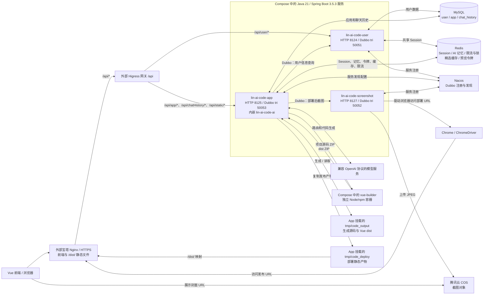
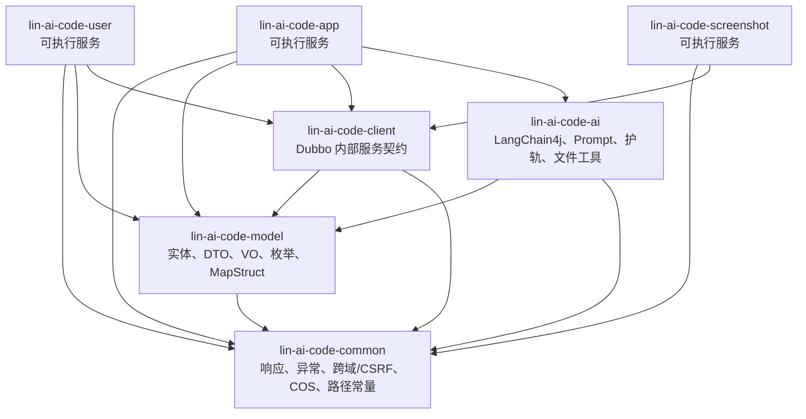

# 项目架构（当前实现）

本文记录当前代码和仓库提供的部署配置；外部基础设施及实际部署步骤见 [deploy/README.md](../deploy/README.md)。业务时序见 [PROJECT_DATA_FLOW.md](PROJECT_DATA_FLOW.md)。前端是独立的 Vue 项目；本仓库包含七个 Maven 模块，其中只有三个模块是可独立启动的 Spring Boot 服务。

## 运行架构

宝塔 Nginx 和 Higress 由外部提供；仓库提供 [Nginx 规则片段](../deploy/nginx/aiapp-rewrite.conf)和路由配置步骤，不包含完整网关实例。服务统一使用 `/api` context path。截图服务配置了 HTTP 端口，但当前没有对前端开放的截图 Controller；截图通过 App 服务的 Dubbo 调用触发。App 配置了 Dubbo tri 端口，但当前业务代码主要作为 User 和 Screenshot 的消费者。服务端口及 Nacos 地址以三个模块的 `application.yml` 为准： [User 配置](../lin-ai-code-user/src/main/resources/application.yml)、[App 配置](../lin-ai-code-app/src/main/resources/application.yml)、[Screenshot 配置](../lin-ai-code-screenshot/src/main/resources/application.yml)。

## 模块关系

箭头表示 Maven 依赖，不是网络调用。`lin-ai-code-ai` 随 App 服务一起运行，没有单独的 AI 服务进程。依赖关系可从 [根 POM](../pom.xml) 和各子模块 POM 核对。

## 服务职责与数据归属

| 组件 | 当前职责 | 持久化或外部依赖 |
| --- | --- | --- |
| User | 注册、登录、注销、用户管理；提供 `InnerUserService` | MySQL `user`；Redis Spring Session |
| App | 应用管理、生成与 SSE、聊天历史、预览、部署、源码下载；调用 User/Screenshot | MySQL `app`、`chat_history`；Redis；模型服务；本机文件目录 |
| Screenshot | 接收 Dubbo 截图请求，使用 Chrome 截图、压缩并上传 | Chrome/ChromeDriver；腾讯云 COS；临时截图目录 |
| Nacos | Dubbo 服务注册与发现 | 三个服务配置同一注册中心 |

HTTP 接口入口分别见 [UserController](../lin-ai-code-user/src/main/java/com/lin/linaicodemother/controller/UserController.java)、[AppController](../lin-ai-code-app/src/main/java/com/lin/linaicodeapp/controller/AppController.java)、[ChatHistoryController](../lin-ai-code-app/src/main/java/com/lin/linaicodeapp/controller/ChatHistoryController.java)、[StaticResourceController](../lin-ai-code-app/src/main/java/com/lin/linaicodeapp/controller/StaticResourceController.java)。Dubbo 契约见 [lin-ai-code-client](../lin-ai-code-client/src/main/java/com/lin/linaicodemother/innerservice/)。

User 和 App 各自访问同一个 MySQL 数据库与 Redis。用户登录后，Spring Session 把登录态存入 Redis；App 从当前 HTTP Session 读取登录用户，不会为每次鉴权再发一次 Dubbo RPC。App 查询应用 VO 所需的用户信息时才调用 User 的 `InnerUserService`。实现见 [InnerUserService](../lin-ai-code-client/src/main/java/com/lin/linaicodemother/innerservice/InnerUserService.java) 和 [AppServiceImpl](../lin-ai-code-app/src/main/java/com/lin/linaicodeapp/service/impl/AppServiceImpl.java)。

## 文件与发布边界

| 路径 | 写入者 | 读取者 | 用途 |
| --- | --- | --- | --- |
| `tmp/code_output/{codeGenType}_{appId}` | App 的代码保存器或 Vue 文件工具 | App 预览、下载、部署 | 生成源码；Vue 的 `dist` 也在该目录内 |
| `tmp/code_deploy/{deployKey}` | App 的部署逻辑 | 生产环境宝塔 Nginx 的 `/dist/` 映射 | 用户发布后的静态产物 |
| 系统临时目录下的截图目录 | Screenshot | Screenshot | JPEG 上传 COS 后清理 |

上述两个 `tmp` 根目录取自 JVM 的 `user.dir`；Compose 将其挂载到 `deploy/data/`。部署地址由 `app.deploy-host` 配置，生产示例为 `https://aiapp.linwh.top/dist/{deployKey}/`；仓库提供 `/dist/` 映射片段，须合并进外部宝塔站点才能生效。多 App 实例运行时仍需解决生成文件和发布文件的共享问题。见 [AppConstant](../lin-ai-code-common/src/main/java/com/lin/linaicodemother/constant/AppConstant.java)、[AppServiceImpl](../lin-ai-code-app/src/main/java/com/lin/linaicodeapp/service/impl/AppServiceImpl.java) 和 [部署说明](../deploy/README.md)。

## 生产部署配置与剩余边界

仓库提供 [Docker Compose](../deploy/compose.yml)、三个运行服务的 Dockerfile、独立 Vue 构建容器和 [Nginx 规则片段](../deploy/nginx/aiapp-rewrite.conf)。Compose 管理单机服务与挂载目录；宝塔站点、Higress、MySQL、Redis、Nacos 和 COS 仍须在仓库外配置。仓库没有数据库迁移、跨 App 实例的共享产物存储或完整观测与回滚方案。

生产环境的 App 通过 `VUE_BUILDER_URL` 将生成源码 ZIP 交给受限的 Vue 构建容器，并将返回的 `dist` ZIP 写回挂载目录；本地开发未配置该地址时才直接调用本机 npm。见 [AiCodeGeneratorFacade](../lin-ai-code-app/src/main/java/com/lin/linaicodeapp/core/AiCodeGeneratorFacade.java) 与 [VueProjectBuilder](../lin-ai-code-app/src/main/java/com/lin/linaicodeapp/core/builder/VueProjectBuilder.java)。

截图服务直接让 Chrome 访问传入 URL，且启用 `--no-sandbox`，见 [WebScreenshotUtils](../lin-ai-code-screenshot/src/main/java/com/lin/linaicodemother/utils/WebScreenshotUtils.java)。上线时仍须限制截图目标并隔离浏览器，且不能把 Dubbo、Nacos、MySQL、Redis 或 Screenshot HTTP 端口公开到互联网。

三个运行模块已启用 `spring-boot-maven-plugin`。当前验证结果见 [部署说明](../deploy/README.md)；[2026-09-24 部署评估](DEPLOYMENT_READINESS_ASSESSMENT_2026-09-24.md)是历史快照，其中缺少可执行 JAR、Compose 和隔离构建的结论已过时。
