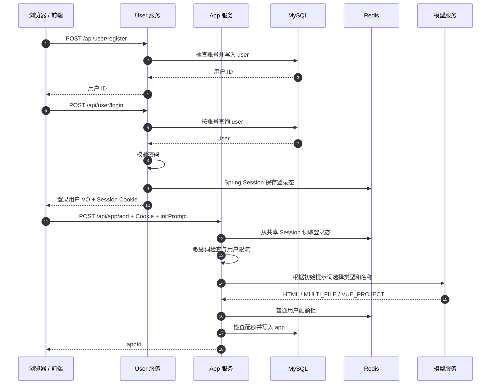
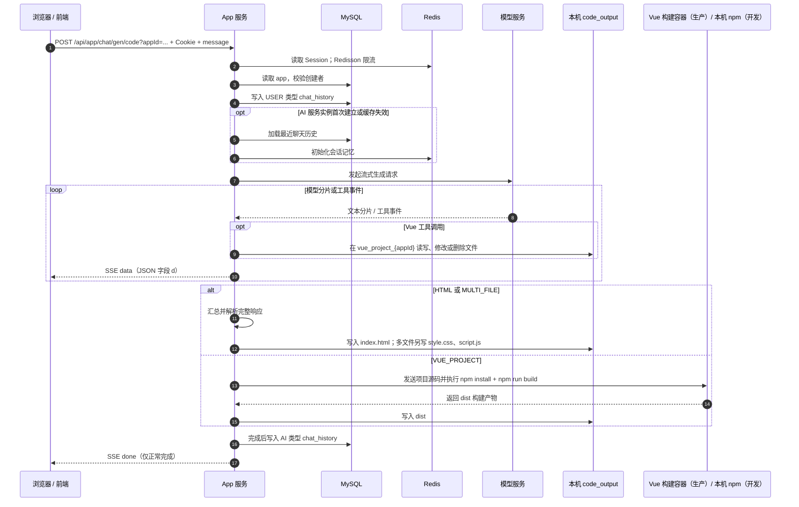
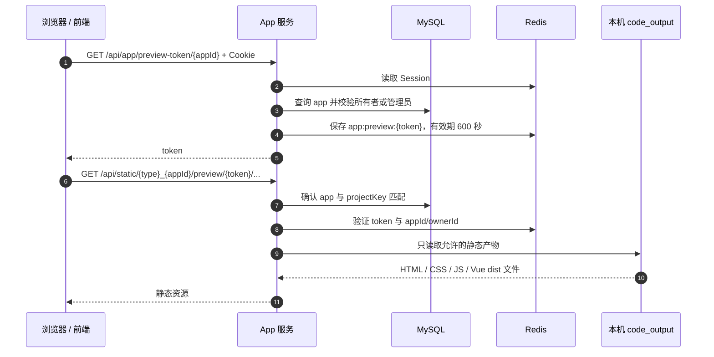
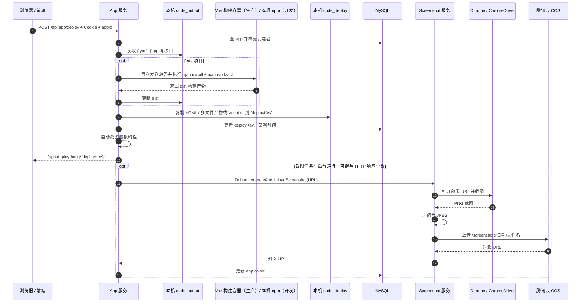
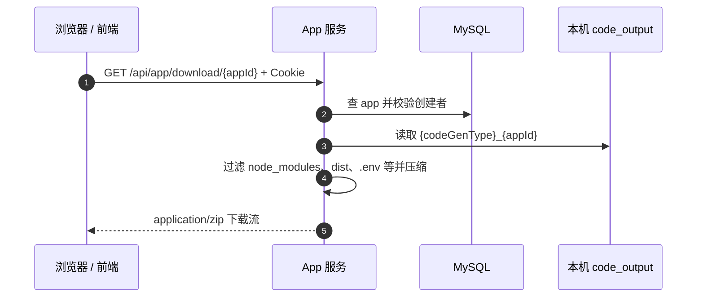
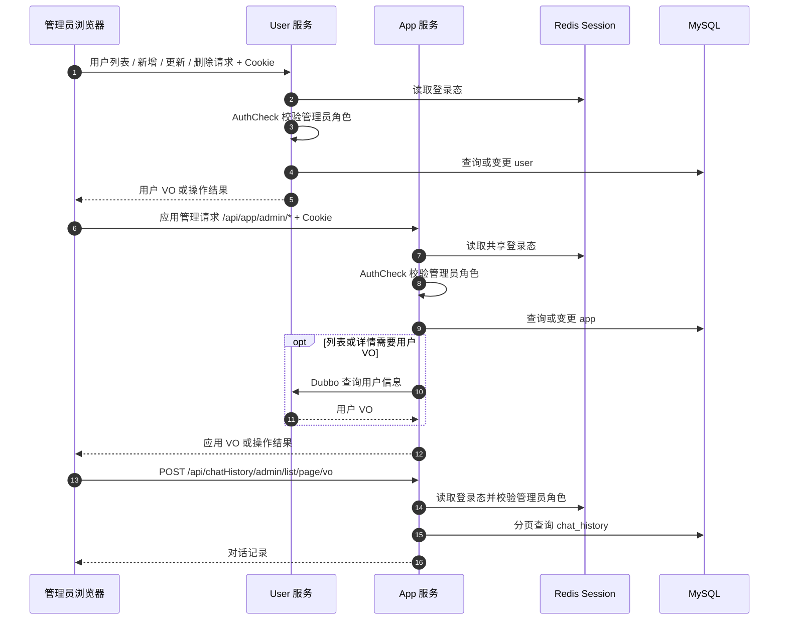

# 项目数据流（当前实现）

本文按浏览器发起的业务操作描述数据的读写与返回路径。运行组件及依赖关系见 [PROJECT_ARCHITECTURE.md](PROJECT_ARCHITECTURE.md)。下图省略仓库外的宝塔 Nginx 和 Higress；仓库提供其路由配置步骤，所有后端 HTTP 路径都带 `/api` 前缀。

## 1. 注册、登录与创建应用

User 与 App 使用同一个 Redis Spring Session；App 通过 `InnerUserService.getLoginUser(request)` 读取当前 Session 中的 User，此步不是 Dubbo 调用。普通用户的应用创建配额按代码类型计算，使用 Redisson 锁；管理员不经过该配额分支。依据：[UserServiceImpl](../lin-ai-code-user/src/main/java/com/lin/linaicodemother/service/impl/UserServiceImpl.java)、[InnerUserService](../lin-ai-code-client/src/main/java/com/lin/linaicodemother/innerservice/InnerUserService.java)、[AppServiceImpl](../lin-ai-code-app/src/main/java/com/lin/linaicodeapp/service/impl/AppServiceImpl.java)、[AppCreationQuotaService](../lin-ai-code-app/src/main/java/com/lin/linaicodeapp/service/AppCreationQuotaService.java)。

## 2. AI 生成与 SSE

代码生成类型在创建应用时确定，具体值为 `html`、`multi_file`、`vue_project`。App 使用 LangChain4j 调用外部模型；Redis 存会话记忆，MySQL `chat_history` 存可查询的用户与 AI 消息。HTML 和多文件模式在流结束后解析并保存；Vue 模式由 AI 工具直接操作项目文件，模型完成回调中构建 `dist`。SSE 的普通数据被包为 `{"d":"..."}`，正常完成才追加 `done` 事件。参考 [CodeGenTypeEnum](../lin-ai-code-model/src/main/java/com/lin/linaicodemother/model/enums/CodeGenTypeEnum.java)、[AppController](../lin-ai-code-app/src/main/java/com/lin/linaicodeapp/controller/AppController.java)、[AiCodeGeneratorFacade](../lin-ai-code-app/src/main/java/com/lin/linaicodeapp/core/AiCodeGeneratorFacade.java)、[AiCodeGeneratorServiceFactory](../lin-ai-code-app/src/main/java/com/lin/linaicodeapp/ai/AiCodeGeneratorServiceFactory.java)。

生成过程有两个值得区分的失败边界：Vue 构建失败会让流报错；HTML/多文件保存异常目前只写日志，可能已向前端发送 `done`。生产 Compose 为 App 配置独立 Vue 构建容器，本地开发未配置 `VUE_BUILDER_URL` 时才调用本机 npm。聊天历史读取接口为 `GET /api/chatHistory/app/{appId}`，由 App 服务校验应用所有者或管理员。

## 3. 预览令牌与静态预览

静态资源也可以由应用所有者的 Session 授权，此时无需预览令牌。HTML/多文件模式只允许固定产物；Vue 模式只读取 `dist`。预览路径、令牌发放、路径规范化与符号链接检查见 [AppController](../lin-ai-code-app/src/main/java/com/lin/linaicodeapp/controller/AppController.java) 和 [StaticResourceController](../lin-ai-code-app/src/main/java/com/lin/linaicodeapp/controller/StaticResourceController.java)。

## 4. 部署、异步截图与封面

部署 HTTP 响应不等待截图完成；封面随后由 App 的虚拟线程经 Dubbo 调用 Screenshot、上传 COS 后更新数据库。返回值由 `app.deploy-host` 配置；生产示例为 `https://aiapp.linwh.top/dist/{deployKey}/`。仓库提供 `/dist/` Nginx 映射片段，须由外部宝塔站点加载，截图服务也须能访问该地址。依据：[AppServiceImpl](../lin-ai-code-app/src/main/java/com/lin/linaicodeapp/service/impl/AppServiceImpl.java)、[VueProjectBuilder](../lin-ai-code-app/src/main/java/com/lin/linaicodeapp/core/builder/VueProjectBuilder.java)、[ScreenshotServiceImpl](../lin-ai-code-screenshot/src/main/java/com/lin/linaicodemother/service/impl/ScreenshotServiceImpl.java)、[WebScreenshotUtils](../lin-ai-code-screenshot/src/main/java/com/lin/linaicodemother/utils/WebScreenshotUtils.java) 和 [部署说明](../deploy/README.md)。

## 5. 源码下载

下载的是生成目录源码，不是 `code_deploy` 的发布目录；当前接口仅允许创建者下载。文件过滤策略见 [AppController](../lin-ai-code-app/src/main/java/com/lin/linaicodeapp/controller/AppController.java) 和 [ProjectDownloadServiceImpl](../lin-ai-code-app/src/main/java/com/lin/linaicodeapp/service/impl/ProjectDownloadServiceImpl.java)。

## 6. 管理端数据流

前端管理页有用户、应用、对话三个入口。后端目前只提供管理员**查询**对话记录的接口，没有管理员删除对话记录接口；前端对话管理页的“删除”操作目前只展示成功提示，未形成数据库写入。前端路由守卫只改善界面体验，最终权限由后端 `@AuthCheck` 控制。相关入口见 [UserController](../lin-ai-code-user/src/main/java/com/lin/linaicodemother/controller/UserController.java)、[AppController](../lin-ai-code-app/src/main/java/com/lin/linaicodeapp/controller/AppController.java) 与 [ChatHistoryController](../lin-ai-code-app/src/main/java/com/lin/linaicodeapp/controller/ChatHistoryController.java)。

## 数据生命周期与失败边界

| 数据或阶段 | 当前落点与生命周期 | 需要关注的失败状态 |
| --- | --- | --- |
| 登录态 | Redis Spring Session；服务配置为 30 天超时 | User 与 App 的 Redis、Session 命名空间或 Cookie 域/路径不一致时，跨服务登录失效 |
| 预览令牌 | Redis `app:preview:{token}`，600 秒有效 | 过期或 Redis 不可用时，预览请求失败；发布站点不使用此令牌 |
| 用户、应用、对话 | MySQL `user`、`app`、`chat_history` | 当前无仓库内数据库迁移脚本，结构与版本需另行管理 |
| 生成源码 | App 工作目录下 `tmp/code_output` | 多实例不共享；HTML/多文件保存异常可能只记录日志，前端仍收到 `done` |
| Vue 构建 | 生产 Compose 的独立容器执行 npm，App 将返回的 `dist` 写入生成目录；本地开发可调用本机 npm | 构建失败会中断生成或部署；构建容器有资源和网络边界，仍须关注不可信依赖 |
| 部署文件 | App 工作目录下 `tmp/code_deploy/{deployKey}`，生产环境映射到宝塔 Nginx `/dist/` | 复制文件与 MySQL 更新不是原子事务；Nginx 规则需在外部站点加载，仓库无完整回滚流程 |
| 截图封面 | Screenshot 临时文件 -> COS；URL 写入 `app.cover` | 截图在返回部署 URL 后异步运行，失败时部署仍成功但封面可能缺失 |

生产环境还需要定义生成物、发布物、COS 对象和数据库记录的清理/保留策略，并为 SSE、构建、Dubbo 截图及各存储依赖建立 traceId、日志、指标和告警；这些不是当前已部署能力。
